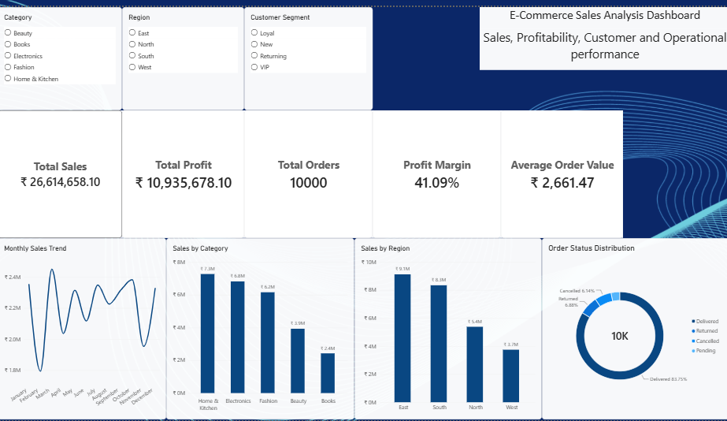
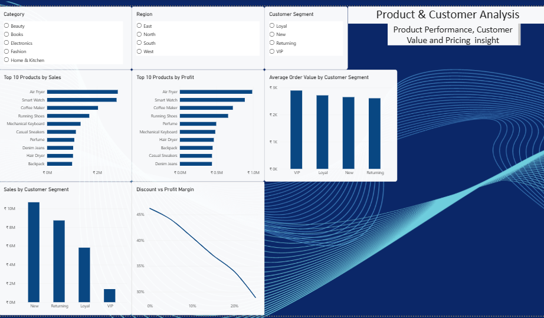

# E-Commerce Sales & Profitability Analysis

## 📊 Project Overview

This project analyzes a synthetic e-commerce dataset containing **10,000 orders** to evaluate sales performance, profitability, customer behavior, regional performance, discount impact, and order fulfillment.

The project uses **Microsoft Excel** for initial analysis and validation and **Microsoft Power BI** for data modeling, DAX calculations, interactive visualization, and dashboard development.

The final Power BI report consists of three analytical pages:

- **Executive Overview**
- **Product & Customer Analysis**
- **Geographic & Operations**

---

## 🎯 Business Problem

The objective of this project is to transform raw e-commerce transaction data into actionable business insights.

The analysis focuses on answering the following questions:

1. How are overall sales and profitability performing?
2. Which product categories and products contribute the most sales and profit?
3. Which customer segments generate the highest sales and average order value?
4. How does discount level relate to profit margin?
5. Which regions and states generate the most sales?
6. How efficiently are orders being fulfilled?
7. What patterns can be identified in shipping time, cancellations, returns, and pending orders?

---

## 📁 Dataset

The dataset contains **10,000 synthetic e-commerce orders** created specifically for this portfolio project.

The data includes information related to:

- Orders
- Customers
- Products
- Categories
- Regions and states
- Customer segments
- Sales
- Profit
- Discounts
- Order status
- Shipping time

The dataset is synthetic and does not represent real customer transactions.

---

## 🛠️ Tools & Technologies

| Tool | Purpose |
|---|---|
| **Microsoft Excel** | Initial data exploration, calculations, and validation |
| **Microsoft Power BI** | Data modeling, analysis, visualization, and dashboard development |
| **Power Query** | Data preparation and transformation |
| **DAX** | KPI calculations and analytical measures |

### Key Skills Demonstrated

- Data cleaning and preparation
- Exploratory data analysis
- Data modeling
- Relationship management
- DAX measures
- KPI development
- Interactive dashboard design
- Business intelligence
- Data storytelling
- Business insight generation

---

## 📊 Dashboard Structure

### 1. Executive Overview

Provides a high-level view of business performance through:

- Total Sales
- Total Profit
- Total Orders
- Average Order Value
- Profit Margin
- Monthly Sales Trend
- Sales by Category
- Sales by Region
- Order Status Distribution

### 2. Product & Customer Analysis

Focuses on product profitability and customer behavior:

- Top 10 Products by Sales
- Top 10 Products by Profit
- Sales by Customer Segment
- Average Order Value by Customer Segment
- Discount vs Profit Margin

### 3. Geographic & Operations

Analyzes regional performance and operational efficiency:

- Top 5 States by Sales
- Sales vs Profit — Top 5 States
- Average Shipping Days by Region
- Order Status by Region

All three pages include interactive filters for **Category, Region, and Customer Segment**.

---

## 🔍 Key Findings

### Sales Performance

- **March** recorded the highest monthly sales at approximately **₹24.50 lakh**.
- **February** recorded the lowest monthly sales at approximately **₹17.94 lakh**.
- Total orders analyzed: **10,000**.
- Average Order Value: approximately **₹2,661**.

### Category Performance

- **Home & Kitchen** generated the highest category sales at approximately **₹72.74 lakh**.
- Home & Kitchen also generated the highest category profit at approximately **₹28.28 lakh**.
- **Books** recorded the highest category profit margin at approximately **52%**.
- **Electronics** recorded the lowest category profit margin at approximately **36%**.

### Product Performance

- **Air Fryer** recorded the highest product sales at approximately **₹28.26 lakh**.
- Air Fryer generated approximately **₹9.87 lakh** in profit.
- Product-level profitability varied considerably across the catalog.

### Customer Performance

- **New customers** generated the highest total sales at approximately **₹1.07 crore**.
- **VIP customers** recorded the highest Average Order Value at approximately **₹2,893**.
- The analysis demonstrates the difference between total customer contribution and average order value.

### Regional Performance

- **East** recorded the highest regional sales at approximately **₹91.30 lakh**.
- **West** recorded the lowest regional sales at approximately **₹37.49 lakh**.

### Discount & Profitability

Profit margin decreased across the observed discount levels:

**46% → 44% → 41% → 37% → 34% → 29%**

from 0% to 25% discount.

This represents an observed association within the dataset rather than proof that discounting alone caused the decline.

### Operations

- Average shipping time: **3.47 days**
- Most common shipping time: **3 days**
- Delivered orders: **84%**
- Returned orders: **7%**
- Cancelled orders: **6%**
- Pending orders: **3%**

---

## 💡 Business Recommendations

### 1. Review Discount Strategy

Evaluate whether higher discount levels generate enough additional sales to compensate for the observed reduction in profit margin.

### 2. Investigate Electronics Profitability

Electronics recorded the lowest category profit margin. Further analysis could examine supplier costs, pricing, discounts, shipping costs, and product-level profitability.

### 3. Protect High-Performing Categories

Home & Kitchen is a major contributor to both sales and profit. Inventory availability and promotional investment could be evaluated for its strongest products.

### 4. Develop VIP Customer Opportunities

VIP customers have the highest AOV but represent a much smaller sales contribution. Customer retention, cross-selling, and premium-product strategies could be explored.

### 5. Investigate Regional Differences

The difference between East and West sales warrants further investigation into customer volume, product mix, marketing activity, pricing, and regional demand.

### 6. Monitor Fulfillment Performance

With 84% of orders delivered and the remaining orders distributed across cancelled, returned, and pending statuses, operational monitoring could help identify opportunities to improve fulfillment performance.

---

## 🧩 Data Model

The Power BI report uses a relational data model connecting the main business entities:

```text 

Customers
    ▼
  Orders ───────────► Products

### Main Tables

| Table | Purpose |
|---|---|
| **Orders** | Transaction-level sales, profit, discount, status, region, and shipping information |
| **Customers** | Customer-related information and customer segmentation |
| **Products** | Product and category information |

Relationships between the tables were established in Power BI to support cross-table analysis and interactive filtering.

## 🧮 Key DAX Measures

###Total Sales
```DAX
Total Sales = SUM(Orders[Sales])
```

### Total Profit
```DAX
Total Profit = SUM(Orders[Profit])
```
### Total Orders
```DAX
Total Orders = COUNTROWS(Orders)
```
### Average Order Value
```DAX
Average Order Value =
DIVIDE([Total Sales], [Total Orders])
```

### Profit Margin
```DAX
Profit Margin =
DIVIDE([Total Profit], [Total Sales])
```

> Note: The Power BI file should be treated as the source of truth if measure names or implementations differ.

## 🔎 Analytical Approach

1. **Data Generation & Preparation**
   - Created a 10,000-row synthetic e-commerce dataset.
   - Organized data into Orders, Customers, and Products tables.

2. **Exploratory Data Analysis**
   - Analyzed sales, profit, orders, AOV, and profit margin.
   - Compared performance across months, categories, products, regions, states, and customer segments.

3. **Data Modeling**
   - Created relationships between Orders, Customers, and Products in Power BI.
   - Built a relational model to support interactive analysis.

4. **KPI Development**
   - Created DAX measures for Sales, Profit, Orders, AOV, and Profit Margin.

5. **Dashboard Development**
   - Built three interactive Power BI pages.
   - Added slicers for Category, Region, and Customer Segment.

6. **Validation**
   - Compared key Power BI outputs against the initial Excel analysis.
   - Tested slicers and cross-filtering to verify dashboard behavior.

7. **Business Interpretation**
   - Identified major sales and profitability patterns.
   - Translated analytical findings into potential business actions.

## 📸 Dashboard Preview

### Executive Overview



### Product & Customer Analysis



### Geographic & Operations


## 🎓 Skills Demonstrated

### Data Analysis

- Exploratory Data Analysis
- Sales and profitability analysis
- Customer segmentation analysis
- Product performance analysis
- Regional analysis
- Discount and margin analysis
- Operational performance analysis

### Power BI

- Data modeling
- Table relationships
- DAX measures
- KPI development
- Interactive slicers
- Cross-filtering
- Dashboard design
- Data storytelling

### Business Analysis

- Identifying performance drivers
- Comparing segments and regions
- Translating data into business insights
- Developing data-driven recommendations

## ⚠️ Limitations

- The dataset is synthetic and does not represent real customer or business transactions.
- The analysis is descriptive and identifies patterns within the available dataset.
- The observed relationship between discount levels and profit margin should not be interpreted as proof of causation.
- Further analysis using real business data could incorporate customer acquisition cost, inventory costs, shipping costs, marketing spend, and customer lifetime value.

## 🏁 Project Outcome

This project demonstrates the complete workflow of a Data Analyst:

**Raw Data → Data Preparation → Exploratory Analysis → Data Modeling → DAX → Visualization → Business Insights → Recommendations**

The final dashboard transforms 10,000 e-commerce transactions into an interactive analytical solution that allows users to explore sales, profitability, products, customers, regions, discounts, and order fulfillment.

The project demonstrates practical skills in both **technical data analysis** and **business-oriented data storytelling**.
